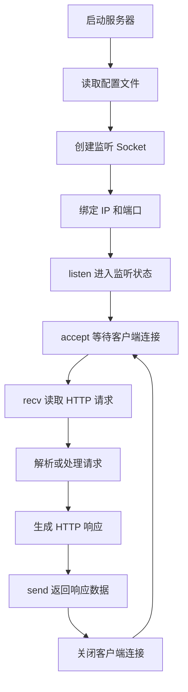
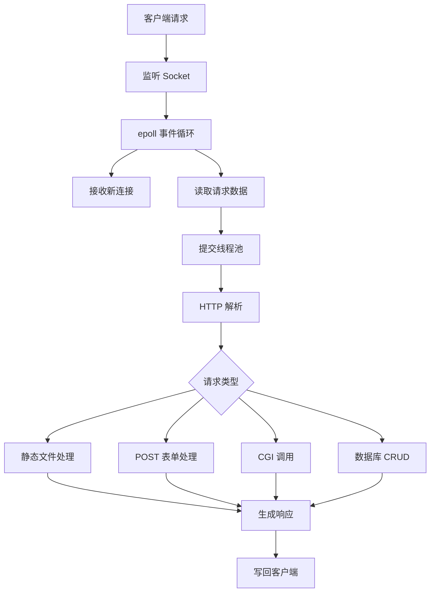

# 项目开始答辩材料
## 1. 项目名称

**C++ 高性能 Web 服务器设计与实现**

本项目计划使用 C++ 在 Linux / Unix 环境下实现一个轻量级 Web 服务器。项目从底层 Socket 编程开始，逐步支持 HTTP 请求解析、静态资源访问、POST 表单处理、CGI 调用、SQLite 数据库 CRUD，并进一步使用 epoll 和线程池提升并发处理能力。

当前项目版本为 **v0.2.0**，已经完成基础工程搭建、配置文件读取和阻塞式 Socket Web Server 原型。

## 2. 项目背景

Web 服务器是互联网系统中的基础组件，负责接收浏览器或客户端发送的 HTTP 请求，并返回 HTML 页面、静态资源或动态处理结果。因此，本项目选择从零实现一个小型的 Web 服务器，加深理解服务器的核心工作流程：

1. 客户端如何与服务器建立 TCP 连接。
2. 服务器如何监听端口并接收请求。
3. HTTP 请求和响应报文如何组织。
4. 静态页面、表单、CGI 和数据库操作如何被服务器处理。
5. epoll 和线程池如何提升并发处理能力。

通过该项目，可以综合训练 Linux 系统编程、网络编程、HTTP 协议、C++ 工程开发、多线程编程和性能测试等能力。

## 3. 项目目标

本项目的最终目标是实现一个可运行、可测试、可演示的 C++ 高性能 Web 服务器。

主要目标如下：

1. 支持在 Linux / Unix 环境下编译和运行。
2. 支持通过配置文件设置端口、线程数、静态资源目录、数据库路径和日志路径。
3. 支持 TCP Socket 监听、连接接收、请求读取和响应发送。
4. 支持 HTTP GET 请求，能够返回 HTML、CSS、JavaScript、图片等静态资源。
5. 支持 HTTP POST 请求，能够处理表单提交。
6. 支持 404、400、403、500 等常见错误响应。
7. 支持简单 CGI 程序调用。
8. 支持 SQLite 数据库增删改查。
9. 使用 epoll 实现 IO 多路复用。
10. 使用线程池提升并发处理能力。
11. 提供功能测试、压力测试和项目文档。

当前阶段目标是先完成基础可运行版本，即阻塞式 Web Server。后续在该版本基础上逐步增加 HTTP 解析、静态文件服务、POST、CGI、数据库、epoll 和线程池。

## 4. 技术栈

| 类型 | 技术选型 | 说明 |
|---|---|---|
| 开发语言 | C++17 | 兼顾底层系统调用和现代 C++ 标准库能力 |
| 构建工具 | CMake | 管理项目编译和可执行文件生成 |
| 操作系统 | Linux / Unix | 项目主要面向 Unix 网络编程环境 |
| 网络编程 | Linux Socket API | 使用 socket、bind、listen、accept、recv、send |
| HTTP 协议 | HTTP/1.1 简化实现 | 自定义解析请求行、Header 和 Body |
| 并发模型 | epoll + 线程池 | 后续用于提升并发连接处理能力 |
| CGI | fork / exec / pipe | 后续用于调用外部 CGI 程序 |
| 数据库 | SQLite | 轻量、无需单独部署，适合课程设计演示 |
| 日志 | 文件日志 / 控制台日志 | 记录启动、连接、请求、错误和数据库操作 |
| 测试工具 | curl、ApacheBench / wrk | 用于功能测试和压力测试 |
| 调试工具 | gdb、valgrind、strace | 用于定位崩溃、内存和系统调用问题 |

当前已使用的技术包括：C++17、CMake、Linux Socket API、基础 HTTP 响应、配置文件解析。

## 5. 系统设计

### 5.1 整体流程图

当前版本采用阻塞式请求处理流程，后续会升级为 epoll + 线程池模型。



后续目标流程如下：



### 5.2 架构设计

项目采用分层、模块化设计，整体架构如下：

```text
Browser / curl
      |
      v
TCP Socket 层
      |
      v
Server 主控模块
      |
      +--> Config 配置模块
      +--> HTTP 请求解析模块
      +--> Static File 静态资源模块
      +--> CGI 动态处理模块
      +--> Database 数据库模块
      +--> ThreadPool 线程池模块
      +--> Logger 日志模块
      |
      v
HTTP Response
```

当前项目已经完成：

1. `Config` 配置模块。
2. `WebServer` 基础服务器模块。
3. 项目目录结构、静态资源目录和脚本目录。

后续会继续补充 HTTP、静态资源、CGI、数据库、线程池和日志模块。

### 5.3 核心模块设计

#### 5.3.1 Config 配置模块

配置模块负责读取 `config/server.conf` 文件，并生成 `ServerConfig` 配置对象。

当前支持配置：

```text
port=8080
thread_num=4
webroot=./webroot
database=./data/server.db
log_file=./logs/server.log
```

已实现能力：

1. 支持 `key=value` 格式。
2. 支持忽略空行。
3. 支持 `#` 注释。
4. 配置项缺失时使用默认值。
5. 整数配置格式错误时回退默认值。

#### 5.3.2 WebServer 服务器模块

服务器模块是当前已经实现的核心模块，主要负责：

1. 创建 TCP socket。
2. 设置 `SO_REUSEADDR`。
3. 绑定监听端口。
4. 监听客户端连接。
5. 接收客户端请求。
6. 输出请求内容。
7. 返回基础 HTTP 响应。
8. 关闭客户端连接。

当前版本使用阻塞模型，适合作为后续高并发版本的基础。

#### 5.3.3 HTTP 模块

HTTP 模块是后续重点实现内容，计划负责：

1. 解析请求行：method、path、version。
2. 解析 Header。
3. 读取 Body。
4. 构造响应状态码、Header 和 Body。
5. 支持 GET、POST 和错误响应。

#### 5.3.4 Static File 静态资源模块

静态资源模块计划负责：

1. 将 URL 路径映射到 `webroot` 目录。
2. 支持 `/` 默认访问 `index.html`。
3. 根据文件后缀设置 `Content-Type`。
4. 文件不存在时返回 `404.html`。
5. 防止 `../` 路径穿越。

#### 5.3.5 ThreadPool 线程池模块

线程池模块计划负责：

1. 创建固定数量工作线程。
2. 使用任务队列保存待处理任务。
3. 使用 `mutex` 和 `condition_variable` 协调线程。
4. 避免每个请求都创建新线程。
5. 提高并发请求处理能力。

#### 5.3.6 CGI 与数据库模块

CGI 模块计划负责调用外部程序处理动态请求。

数据库模块计划使用 SQLite，实现用户表或留言表的增删改查，并通过页面展示操作结果。

## 6. 项目亮点 / 技术难点

### 6.1 项目亮点

1. **从底层 Socket 实现 Web Server**  
   项目没有直接使用现成 Web 框架，而是从 `socket`、`bind`、`listen`、`accept`、`recv`、`send` 开始实现服务器主流程。

2. **分阶段迭代设计**  
   当前先实现阻塞式服务器，后续再升级为 epoll 和线程池模型，便于对比不同版本的性能和复杂度。

3. **配置化启动**  
   端口、线程数、静态资源目录、数据库路径和日志路径都通过配置文件管理，提升了项目可维护性。


### 6.2 技术难点

1. **HTTP 协议解析**  
   需要正确处理请求行、Header、Body、Content-Length、不同请求方法和异常请求。

2. **非阻塞 IO 状态管理**  
   epoll 模型中，一次读写不一定完整，需要维护连接状态、读缓冲区和写缓冲区。

3. **线程池并发安全**  
   多线程处理请求时，需要解决任务队列同步、日志写入同步和资源生命周期管理问题。

4. **CGI 与数据库处理**  
   CGI 涉及进程创建、参数传递和管道通信；数据库操作需要考虑 SQL 注入、输入校验和错误处理。

## 7. 项目进展

当前项目已经完成基础版本，主要进展如下：

| 模块 | 当前状态 | 说明 |
|---|---|---|
| 开发环境搭建 | 已完成 | 使用 CLion 作为开发 IDE，远程连接 Rocky Linux 9.7 环境进行编译、运行和 Debug 调试 |
| 项目骨架 | 已完成 | 已建立 CMake 工程和目录结构 |
| README | 已完成基础版 | 包含环境、构建、运行和路线图 |
| 配置文件 | 已完成基础版 | 支持读取端口、线程数、webroot、数据库和日志路径 |
| TCP Socket 服务 | 已完成基础版 | 支持 socket、bind、listen、accept |
| 请求读取 | 已完成基础版 | 使用 recv 读取客户端 HTTP 请求 |
| 响应发送 | 已完成基础版 | 返回固定 200 OK HTML 响应 |
| 静态资源目录 | 已准备 | 已有 index.html、404.html、CSS、JS |
| 构建脚本 | 已准备 | 提供 build.sh |
| 运行脚本 | 已准备 | 提供 run.sh |
| 压测脚本 | 已准备初稿 | 提供 benchmark.sh |
| GET 静态文件 | 未完成 | 下一阶段实现 |
| POST 表单 | 未完成 | 后续实现 |
| CGI | 未完成 | 后续实现 |
| SQLite CRUD | 未完成 | 后续实现 |
| epoll | 未完成 | 后续实现 |
| 线程池 | 未完成 | 后续实现 |

当前版本可以概括为：**已经打通服务器启动、监听端口、接收请求、返回响应的最小闭环**。

## 8. 运行效果

### 8.1 编译项目

在 Linux 环境下执行：

```bash
cmake -S . -B build
cmake --build build
```

或使用脚本：

```bash
./scripts/build.sh
```

### 8.2 启动服务器

```bash
./build/webserver config/server.conf
```

预期输出：

```text
Config file: config/server.conf
Thread count: 4
Web root: ./webroot
Database: ./data/server.db
Log file: ./logs/server.log
HighPerformanceWebServer v0.2.0
Listen port: 8080
Blocking socket server is running.
Open http://127.0.0.1:8080/ in your browser.
```

### 8.3 访问服务器

使用浏览器访问：

```text
http://127.0.0.1:8080/
```

或使用 curl：

```bash
curl http://127.0.0.1:8080/
```

当前服务器会返回一个固定 HTML 页面，表示基础 Web Server 已经正常运行。

### 8.4 当前响应示例

```http
HTTP/1.1 200 OK
Content-Type: text/html; charset=utf-8
Content-Length: ...
Connection: close
```

响应体示例：

```html
<h1>HighPerformanceWebServer v0.2</h1>
<p>Blocking socket server is running.</p>
```

说明当前项目已经完成从客户端请求到服务器响应的基础链路。

## 9. 后续开发计划

### 9.1 第一阶段：完善 GET 静态资源服务

计划完成：

1. 解析 HTTP 请求行。
2. 支持 GET 方法。
3. 支持 `/` 自动映射到 `/index.html`。
4. 支持读取 `webroot` 下 HTML、CSS、JS 和图片。
5. 根据文件后缀设置 `Content-Type`。
6. 文件不存在时返回 404 页面。
7. 防止路径穿越。

### 9.2 第二阶段：支持 POST 表单

计划完成：

1. 解析 HTTP Header。
2. 解析 `Content-Length`。
3. 读取请求体。
4. 支持 `application/x-www-form-urlencoded`。
5. 编写表单页面并返回提交结果。

### 9.3 第三阶段：实现 CGI

计划完成：

1. 创建 `cgi-bin` 目录。
2. 识别 `/cgi/` 请求路径。
3. 调用外部 CGI 程序。
4. 通过管道传递参数和读取输出。
5. 返回 CGI 生成的 HTML。

### 9.4 第四阶段：实现 SQLite 数据库 CRUD

计划完成：

1. 初始化 SQLite 数据库。
2. 创建用户表或留言表。
3. 支持新增、查询、修改、删除。
4. 通过页面提交数据库操作。
5. 返回数据库操作结果页面。

### 9.5 第五阶段：升级为 epoll + 线程池

计划完成：

1. 将监听 socket 和客户端 socket 设置为非阻塞。
2. 使用 epoll 管理连接事件。
3. 实现连接读写状态管理。
4. 实现线程池任务队列。
5. 主线程负责 IO 事件监听，工作线程负责业务处理。
6. 对比阻塞版和高并发版性能。

### 9.6 第六阶段：测试、压测和文档整理

计划完成：

1. 编写功能测试记录。
2. 使用 curl 测试 GET、POST、404、CGI 和数据库接口。
3. 使用 ApacheBench 或 wrk 进行压力测试。
4. 记录 QPS、平均延迟、失败请求数、CPU 和内存使用率。
5. 完成课程设计报告、压测报告和最终答辩 PPT。

总体来说，后续开发会按照“先功能完整，再提升性能，最后补充测试和文档”的顺序推进。
